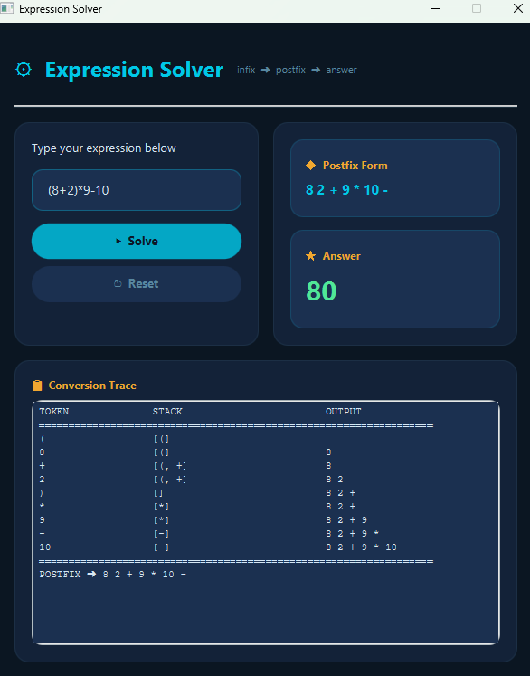
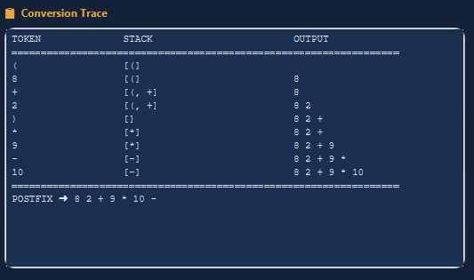

# Expression Solver ⚙️

A JavaFX desktop application that evaluates mathematical infix expressions at runtime. The application converts infix notation to postfix (Reverse Polish Notation) using the classic **Shunting-Yard algorithm** and evaluates the result using a stack-based calculator.

## 🌟 Features
- **Real-time Conversion:** Step-by-step trace output of the infix-to-postfix conversion process.
- **Stack-Based Evaluation:** Supports `+`, `-`, `*`, `/`, `^`, and parentheses `()`.
- **Ocean-Themed UI:** A beautifully designed, responsive dark-themed interface.
- **Robust Error Handling:** Detects unbalanced parentheses, division by zero, and malformed tokens.

## 📸 Screenshots
*(Below are previews of the application)*


*Evaluating a standard mathematical expression.*


*Detailed per-token conversion trace in the bottom panel.*

## 🚀 How to Run

### Prerequisites
- **Java Development Kit (JDK):** Version 17 or higher.
- **JavaFX SDK:** Ensure JavaFX modules are configured in your IDE.

### Running via IDE (IntelliJ IDEA / Eclipse)
1. Clone this repository:
   ```bash
   git clone [https://github.com/aly598/Infix-to-Postfix-JavaFX.git](https://github.com/aly598/Infix-to-Postfix-JavaFX.gitt)